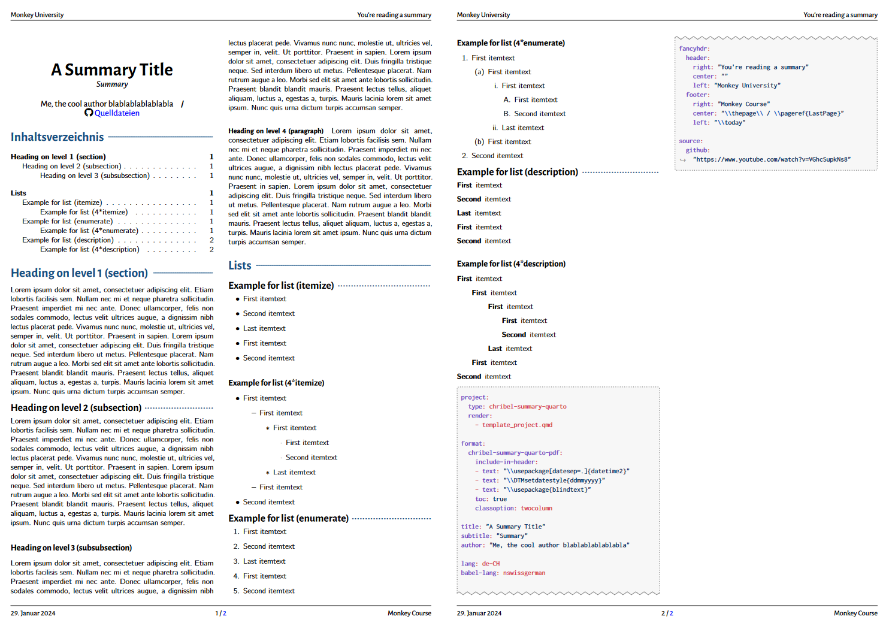

# Chribel Summary Quarto

A quarto template, which can be used to write course summaries. It uses `pdflatex`!

> [!NOTE]
> *Chribel* means doodle or scribbe in Swiss German. It has no meaning whatsoever, just sounds silly :)

> [!WARNING]
> This is not a definitive version of the template and still has a bunch of stuff which requires special attention, such as font changing. If time is sufficient I might turn some of the $\LaTeX$ components into Quarto properties.

## Creating a New Document

To create a new project using this format.

```bash
quarto use template joelvonrotz/chribel-summary-quarto
```

This will create a new directory with an example document that uses this format.

## Using with an Existing Document

To add this format to an existing project:

```bash
quarto add joelvonrotz/chribel-summary-quarto
```

Then, add the format to your document options (variants shown below):

```yaml
format: chribel-summary-quarto-pdf
```

```yaml
format:
  chribel-summary-quarto-pdf:
    ... # for additional options
```

> [!NOTE]
> As this template is based on the `pdf`-format, all the same options can be used. See [Quarto: PDF Options](https://quarto.org/docs/reference/formats/pdf.html)

## Using it in a project

The template is somewhat project-safe. To use this template in a project, create a `_quarto.yml` file and insert the minimum options

```yaml
project:
  type: chribel-summary-quarto
  render:
    - <document.qmd>
```

## Options

The template comes with a couple of options, of which some you might need to change, depending on your language or the amount of people part of the project (authors, supervisors, experts).

> [!NOTE]
> Default values are indicated with `#default` comment!

A lot of the options are the same as the ones from the Quarto [PDF options](https://quarto.org/docs/reference/formats/pdf.html).

### Title & Subtitle

```yaml
title: "Silly title for silly writing"
subtitle: "Course for silly writing"
```

### Authors, Supervisors and Experts

Compared to the [academic](https://github.com/joelvonrotz/chribel-academic-quarto) template, only one author is given. So if more people worked on the summary, just extend the field with the names.

```yaml
author: "Author 1, Author 2 & Author 3"
```

### Language

Just two Quarto options, which might be useful for you.

```yaml
lang: en-GB
babel-lang: ukenglish
```

### Header and Footer

Using the LaTeX package `fancyhdr`, 

```yaml
fancyhdr:
  header:
    right:  "\\texttt{fancyhdr.header.right}"
    center: "\\texttt{fancyhdr.header.center}"
    left:   "\\texttt{fancyhdr.header.left}"
  footer:
    right:  "\\texttt{fancyhdr.footer.right}"
    center: "\\texttt{fancyhdr.footer.center}"
    left:   "\\texttt{fancyhdr.footer.left}"
```

An example would be:

```yaml
fancyhdr:
  header:
    right: "\\nouppercase{\\rightmark}" # add current section title
    center: ""
    left: "Ass Kicking FS24"
  footer:
    right: "Cool Author 3000"
    center: "\\thepage\\ / \\pageref{LastPage}"
    left: "\\today"
```

### Date Format

> [!CAUTION]
> Changing the date format is a bit finicky, but it is possible. Following example sets the date format to 'DD.MM.YYYY'.
>
> ```latex
> \usepackage[datesep=.]{datetime2}
> \DTMsetdatestyle{ddmmyyyy}
> ```
>
> `\today` needs to be replaced with `\DTMtoday` in the document.

## Example

There are two examples, which render to `.pdf`-documents.

- \[[template_document.qmd](template_document.qmd)\]: document using the YAML [frontmatter](https://quarto.org/docs/manuscripts/authoring/vscode.html#front-matter) 
- \[[template_project.qmd](template_project.qmd)\]: [project](https://quarto.org/docs/projects/quarto-projects.html) using the document options from [_quarto.yml](_quarto.yml).

---

## Defaults values (found in `_extension.yml`)

The following yaml lines contain the default values (which are set `_extension.yml`).

```yaml
pdf-engine: pdflatex
documentclass: article

geometry:
  - "top=18mm"
  - "bottom=15mm"
  - "left=5mm"
  - "right=5mm"
papersize: a4
fontenc: T1
fontsize: 10pt
pagenumbering: none

include-in-header:
  - config/preamble.tex
include-before-body: 
  - config/before-content.tex
template-partials:
  - partials/before-body.tex

toc: true
toc-depth: 3
number-sections: false

fig-pos: H
fig-align: center

code-block-bg: "#f7f7f7"
code-line-numbers: false
highlight-style: github
```